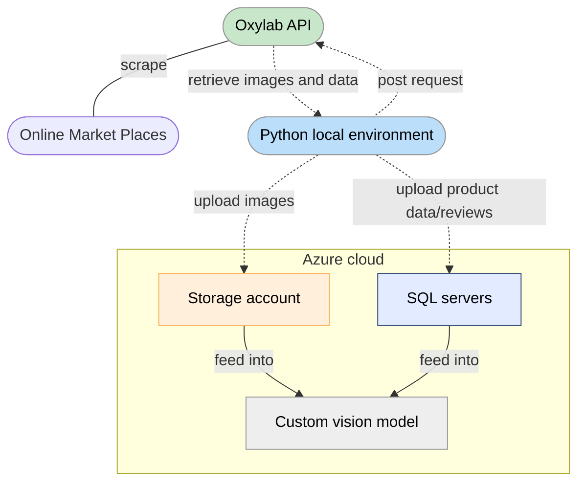

```mermaid
flowchart TD
 subgraph azure["Azure cloud"]
        storage["Storage account"]
        sql["SQL servers"]
        ai["Custom vision model"]
  end
    oxylab(["Oxylab API"]) -- "scrape" --- omk(["Online Market Places"])
    local(["Python local environment"]) -. "post request" .-> oxylab
    oxylab -. "retrieve images and data" .-> local
    storage -- "feed into" --> ai
    sql -- "feed into" --> ai
    local -. "upload images" .-> storage
    local -. "upload product data/reviews" .-> sql
     storage:::Peach
     sql:::Sky
     ai:::Ash
    classDef Sky stroke-width:1px, stroke-dasharray:none, stroke:#374D7C, fill:#E2EBFF, color:#000000
    classDef Peach stroke-width:1px, stroke-dasharray:none, stroke:#FBB35A, fill:#FFEFDB, color:#000000
    classDef Ash stroke-width:1px, stroke-dasharray:none, stroke:#999999, fill:#EEEEEE, color:#000000
    style oxylab fill:#C8E6C9,stroke:#999,color:#000000
    style local fill:#BBDEFB,stroke:#999,color:#000000
```
